# Pokédata
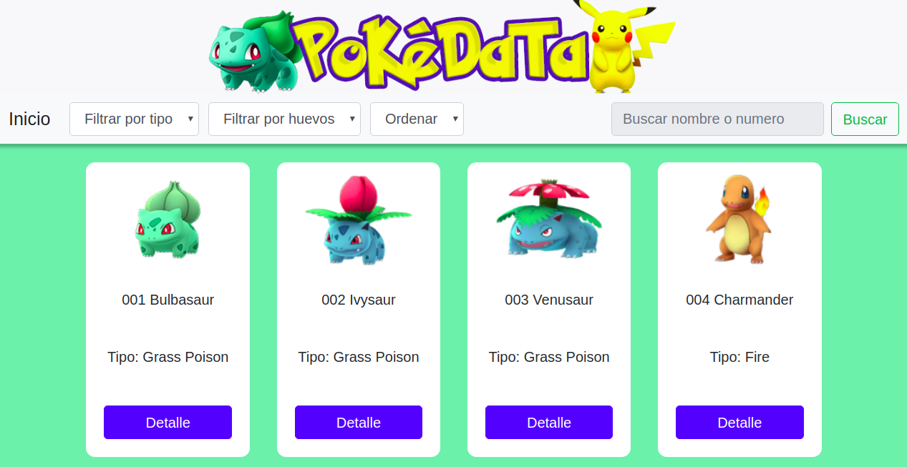

# ¿Qué es Pokemon GO? 🤷‍

Antes de comenzar con la explicación de nuestra página es importante señalar en primera instancia el juego en el que nos inspiramos para crearla.
Pokémon GO es un videojuego de realidad aumentada basado en la localización desarrollado por la empresa Niantic cuyo dueño fue creador de Google maps. Es un juego casual para dispositivos iOS y Android. Es videojuego gratuito, contiene microtransacciones. Pokémon GO está creado en la plataforma de juego del mundo real de Niantic y utiliza ubicaciones reales de GPS para animar a los jugadores a que salgan a explorar para capturar Pokémones.

# Introducción👩‍🏫

Pokedata es una aplicación web responsiva que fue creada y pensada en aquellos jugadores del juego Pokemon GO que recién están adentrándose en el universo posponé y buscan cierta orientación al momento de elegir sus pokemones. 

# Información sobre el proceso

Luego de leer y comentar los requisitos del proyecto, lo primero que realizamos fue una lista de tareas, ordenadas en base a las prioridades necesarias para cumplir con lo requerido. De acuerdo a nuestra lista de tareas realizada en Trello.
## Planificación📌

[Clic Aquí para ver planificación](https://trello.com/b/7o0XmKMJ/data-lovers-pokemon) 

Luego comenzamos con las entrevistas , para obtener nuestras Historias de Usuario, y así tener una idea mas clara de como debía ser nuestra aplicación.
Luego de tomar la decisión respecto a cual sería nuestra data el primer paso fue la realización de un diagrama de flujo.
## 1 Diagrama de flujo✍🏻

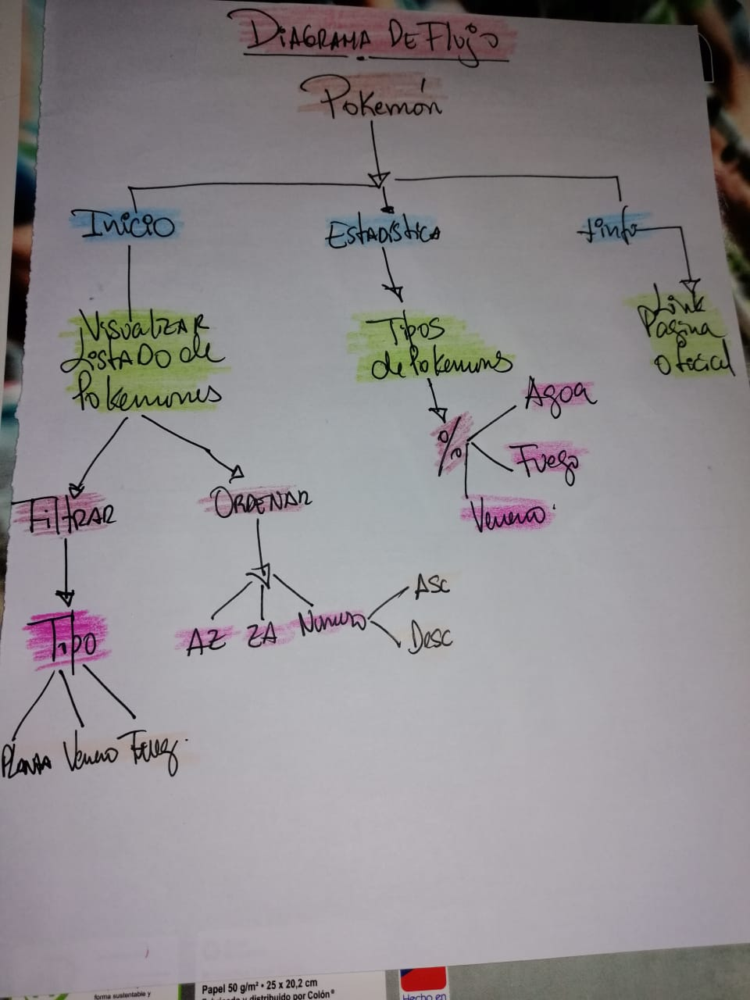

Seguido de esto un prototipo de baja fidelidad que nació de la imaginación del equipo como el reflejo de lo que podría ser una buena pagina que contenga información sobre pokemones .Fue modificado con posterioridad luego de recibir feedback y sugerencias de nuestra compañeras.
## 2 Primer prototipo de baja fidelidad

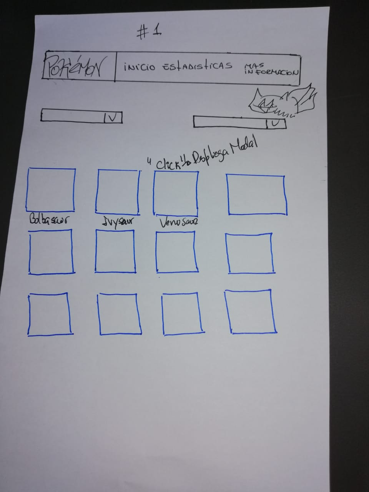

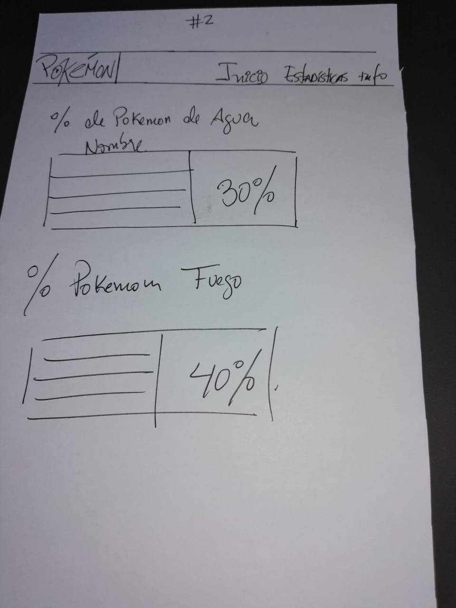

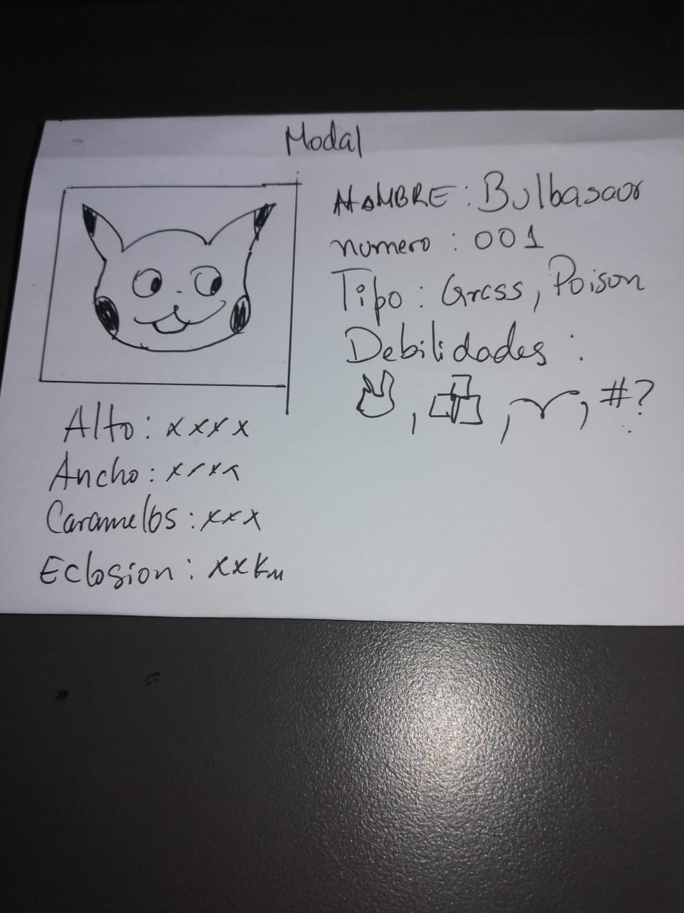

## 3 Segundo prototipo de baja fidelidad

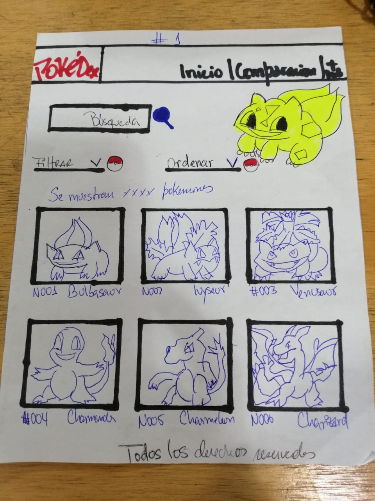

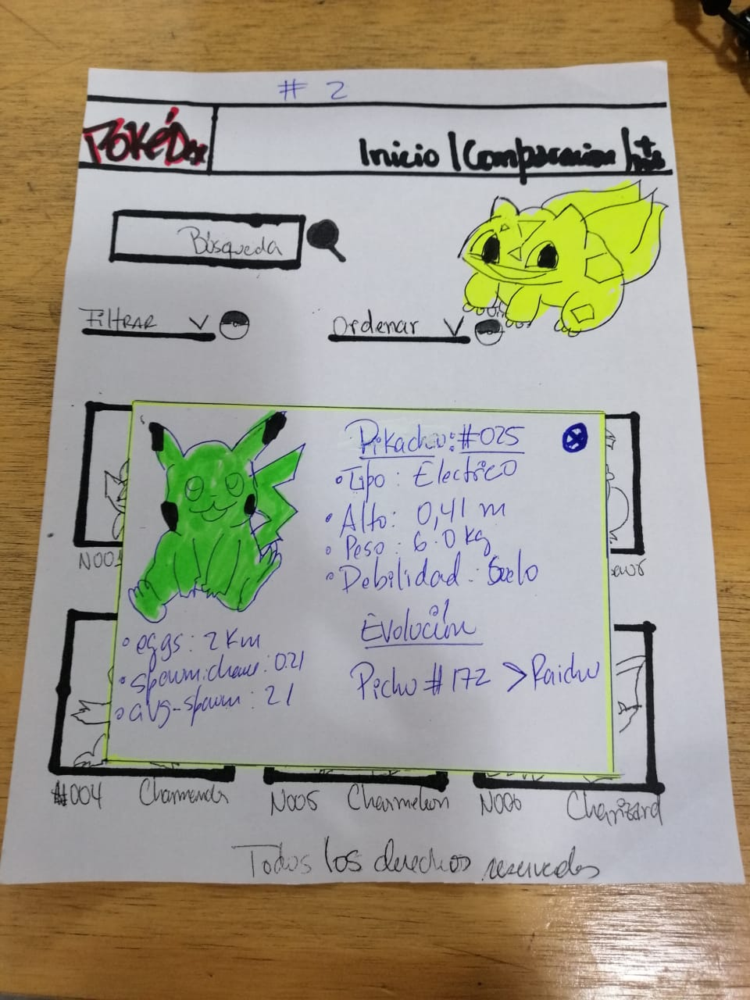

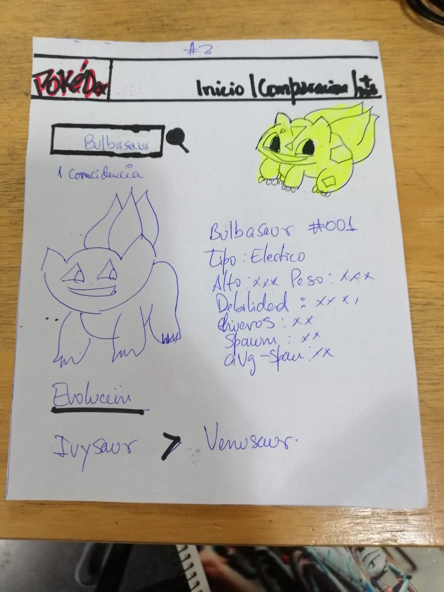

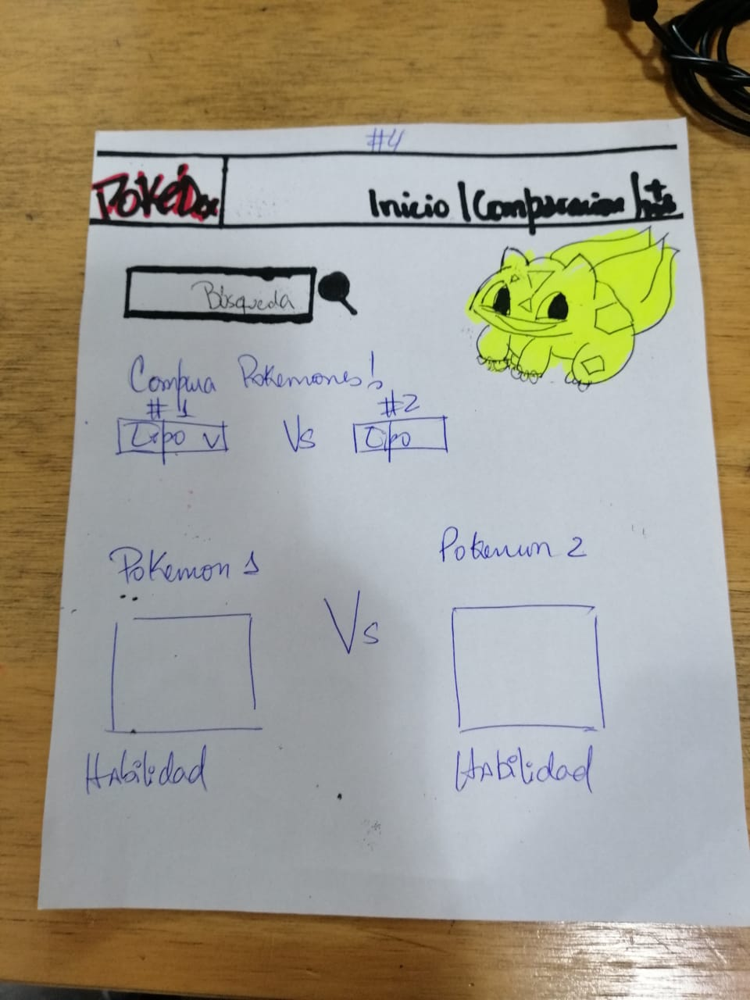

Por otro lado realizamos un prototipo de alta fidelidad en figma que fue nuestra guiá para comenzar con la elavoracion de la pagina.
# Prototipo de alta fidelidad

[clic Aquí para ver prototipo de alta fidelidad en figma](https://www.figma.com/file/WUvV6OsTJVs2rOzWKksQF9jo/datalovers-Colors?node-id=85%3A0)

[clic Aquí para ver prototipo de alta fidelidad en zeplin](zpl.io/a7W1dov)

# Encuesta 📊

Ademas realizamos una encuesta en linea para informarnos de los aspectos que debería considerar nuestra pagina tomando en cuenta que debíamos filtrar ,ordenar y calcular la encuesta reflejo que los usuarios esperan ver los nombres de cada pokémon ,también ,consideran relevante un filtro por tipo de pokémon y quieren información de como conseguir que eclosionen los huevos . dicha encuesta no proporcionó suficiente información ya que consideramos que no realizamos bien las preguntas desde el principio por lo mismo y basándonos en el aprendizaje que nos dejó la mala formulación de preguntas en dicha encuesta decidimos Hacer testeo con la página en funcionamiento
y con la información obtenida implementamos mejoras tanto en diseño como en funcionamiento.

[Clic aquí para ver encuesta](https://docs.google.com/forms/d/1Hx50ndrGJxEoFttq1uDXe0O-Y0F3yDBKP0_1mGCalLY/edit#responses)

# Historias de usuario

## Historia de usuario 1

YO COMO usuario nuevo del juego QUIERO poder ver todos los pokemones para visualizar la lista de todos los pokemones que existen.

## Historia de usuario 2

YO COMO jugador novato de pokemon go QUIERO poder filtrar mi pokémon por tipo PARA ver sus características.

## Historia de usuario 3

YO COMO usuario nuevo de pokemon go QUIERO poder ordenar los pokemones por número o alfabéticamente para ubicar el personaje mas rápido.

## Historia de usuario 4

YO COMO usuario principiante QUIERO saber cuantos pokemones hay de tipo agua para completar mi colección de pokemones de ese tipo.

## Historia de usuario 5

YO COMO usuario nuevo QUIERO saber cuántos kilómetros caminar para que mi huevo nazca y poder tener un nuevo pokemon.

# Objetivos de la aplicación

- Entrar a la plataforma directamente sin necesidad de loguearse o ingresar datos personales .

- Visualizar Pokémones directamente al entrar en la pagina.

- Clasificar y filtrar pokémones según los deseos del usuario para acceder mas fácilmente a alguna característica específica como:

* Filtrar pokémon por tipo según desee el usuario.

* Ordenar pokémon por número del 1 al 151 y viceversa.

* Ordenar pokemon de A a Z y viceversa.

* Realizar cálculo.

# Testeos de usabilidad de primer diseño de interfaz

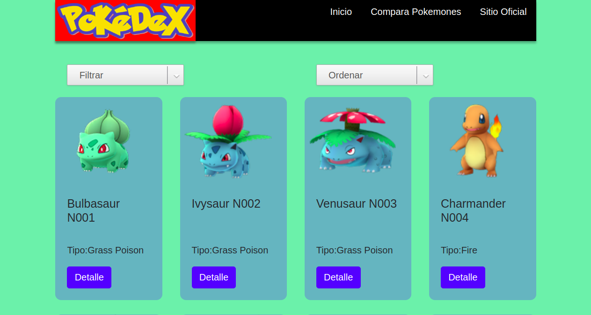

### A continuación algunos de los videos de nuestro test de usabilidad con los cuales comenzamos a realizar los cambios finales.📷

[Clic aquí para ver video 1](https://www.youtube.com/watch?v=jqEzKbV3CJE&t=4s)

[Clic aquí para ver video 2](https://www.youtube.com/watch?v=urbgxaAD7UY)

[Clic aquí para ver video 3](https://www.youtube.com/watch?v=juWHDOijrNU&t=18s)

[Clic aquí para ver video 4](https://www.youtube.com/watch?v=0Px_2PRhH8w)

# Resultados de test de usabilidad
## En base a los testeos de usabilidad se pudo obtener las siguientes impresiones de los usuarios:

* No queda claro el botón filtrar, se debe indicar que es lo que se esta filtrando.

* Los botones deben se mas llamativos.

* Los colores del header junto con el color del logo no se complementan.

* Se sugiere armonizar los colores en la página y modificar tamaño de logo.

* El botón detalle no esta operativo.

* Falta un botón que nos permita volver al principio de la pagina porque no resulta cómodo tener que usar el scroll para ir al principio dada la cantidad de elementos.

* No queda claro a que se refiere el orden ascendente y descendente se debería indicar que se ordena por número.

* El botón que permite ordenar los pokemones debería decir ordenar e indicar que es lo que se ordena o de que manera se realiza el orden.

* No se entiende claramente la finalidad de la página ya que no posee un título o alguna explicación que nos ayude a entender de que se trata la página.

* Los elementos del filtro se sugiere sean en español para aquellos usuarios que no hablan inglés.

# Desarrollando iteración 

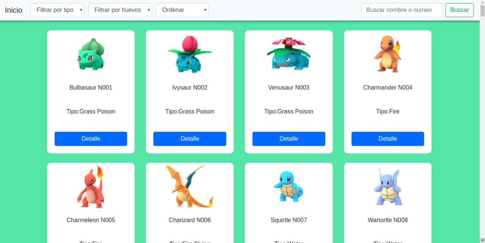

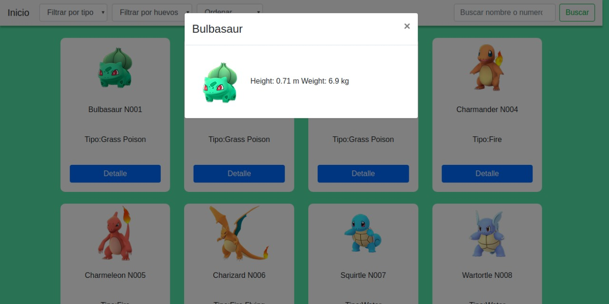

# Nuestro Producto 

Posterior a los testeos con usuarios se procedió a integrar colores, imágenes y detalles en cuanto a diseño visual y uso de la página. Con el siguiente resultado que esperamos mejorar para una futura iteración.

# Cómo el producto soluciona los problemas/necesidades de los usuarios.

Para identificar como el producto soluciona necesidades en los usuarios nos basamos en las historias de los mismos priorizando aquellas necesidades de mayor interés en las que se destacan que se muestren todos los 151 pokemones con sus respectivos nombres, características, filtro por tipo ,orden por número o por alfabeto ,filtrar por huevo, conocer estadísticas de porcentaje de pokemones por tipo,distancia que se debe recorrer para que un huevo nazca.

# Pruebas unitarias

Filtrar Ordenar Calcular

# Consideraciones técnicas
La lógica del proyecto esta implementada completamente en JavaScript, HTML y CSS.

# Herramientas
- Git
- GitHub
- GitHub Pages
- HTML5 
- CSS3
- Vanilla JS
- Node.js
- Mocha
- Bootstrap 4.

# Conclusión

Nuestro último objetivo es seguir generando iteraciones hasta que el producto final sea de total agrado y conveniencia para nuestro usuario de tal manera que nuestro producto sea usable y además genere una gran experiencia de usuario.

# Demostración
En el siguiente vinculo puedes acceder a la Pokédata y experimentar el funcionamiento de la aplicación: [Enlace](https://nohestmm.github.io/SCL009-data-lovers/src/index.html)

