Para poder desarrollar esta página se realizaron 3 historias de usuarios que se detallan a continuación, ademas de eso realizamos una [planificación](https://trello.com/b/9UhZWpzO/data-lovers) del tiempo de trabajo lo que nos permitió poder llevar a cabo todas las tareas.

## **Historias de usuario.**
**Caso n°1.**  
Yo **COMO** jugador novato/intermedio de LoL, server *LAS* (Latinoamérica Sur), **QUIERO** conocer las características de mi Campeón, **PARA** desempeñarme mejor en la partida y ganar *XP* (experiencia). 

_Criterios de aceptación._
1.  Información simple y ordenada.
2.  Campeones divididos por roles.
    o	Roles ordenados por orden alfabético.
3.  Un lugar donde se detalle la información del campeón.

Como primer paso de este proceso realizamos un prototipo de baja fidelidad con el cual se llevaron a cabo entrevistas a diferentes usuarios.

Identificamos que el usuario novato o principiante de LOL requiere conocer ciertas características de los campeones para poder escoger con mayor precisión cual es el que se adecua a la partida que quiere jugar. Es por esta razón que nuestra primera historia de usuario se enfoca en poder satisfacer esta necesidad.

En las siguientes imágenes se puede observar nuestro _PBF_ (prototipo de baja fidelidad)

Esta es la página de inicio.
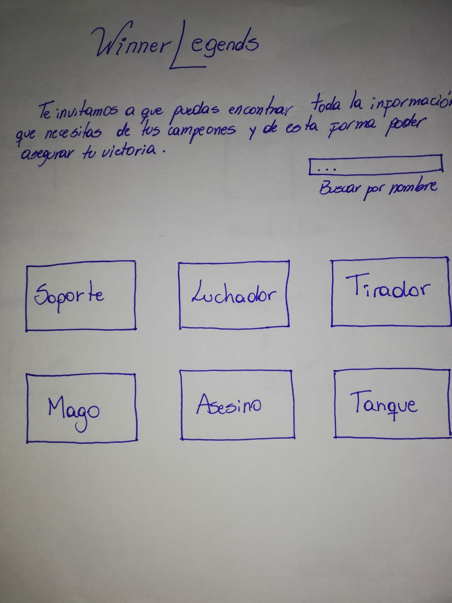
Segunda página.
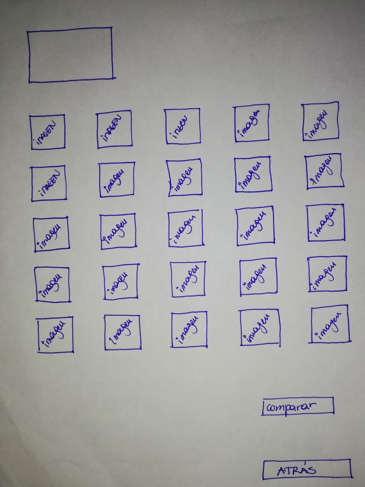
Aquí colocamos el rol que escogía el usuario, luego de presionar en la primera página
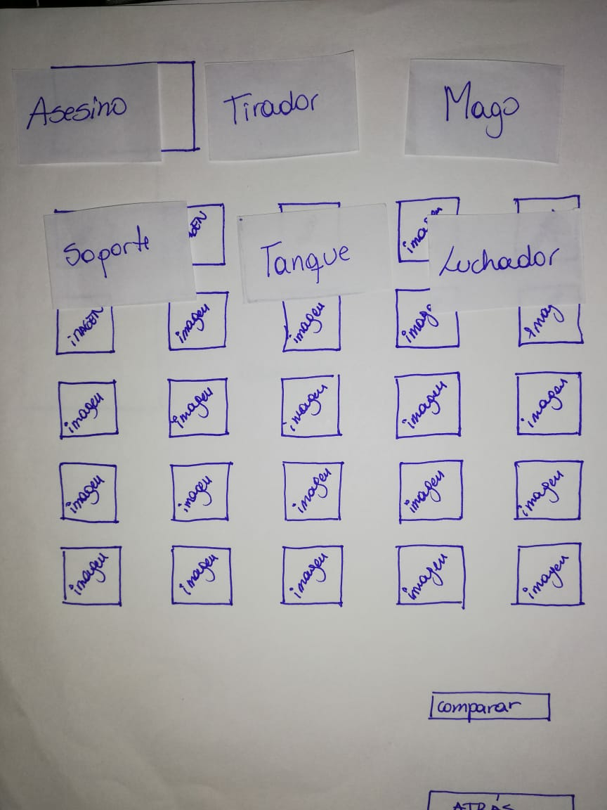
Y luego obtenían la página final donde se encuentra la información que necesitan de cada campeon.
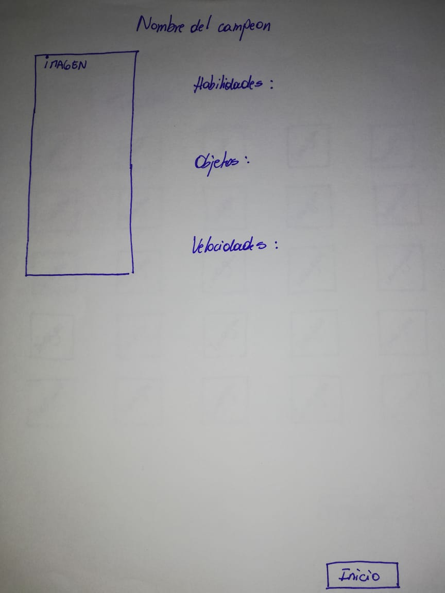

Y ahora podemos observar las entrevistas realizadas al [usuario 1](https://www.youtube.com/watch?v=RjAXF70T8EM&feature=youtu.be), luego al [usuario 2](https://www.youtube.com/watch?v=-JPRpwIC0D8&feature=youtu.be) y al [usuario 3](https://www.youtube.com/watch?v=soch-PYCv4k&feature=youtu.be).

Durante los test de prototipo de baja fidelidad que realizamos a los usuarios  pudimos verificar que la interfaz propuesta cumple con los criterios de aceptación de nuestra primera historia de usuario. Existen sugerencias de parte de los entrevistados que podemos agregar en nuestro diseño, como por ejemplo las características de los campeones que ellos necesitan que estén descritas en las fichas de cada uno, entre ello mencionaron:

1.      La línea de juego en la que puede participar cada campeón

2.      La forma en la que pueden ir evolucionando a lo largo de la partida

3.      Cuáles son los campeones más utilizados

Todas estas sugerencias han sido evaluadas y se intentarán implementar, pero principalmente nos guiaremos por los datos que nos entrega la data.

Además de este prototipo realizamos uno de alta fidelidad en [figma](https://www.figma.com/proto/VsSkrYK7O8IIJ6ozy9n2lodY/Intento-mil?node-id=1%3A2&scaling=scale-down) que tiene las mismas caracteristicas que el testeado y posteriormente lo exportamos a [zeplin](zpl.io/V4eOQBM)
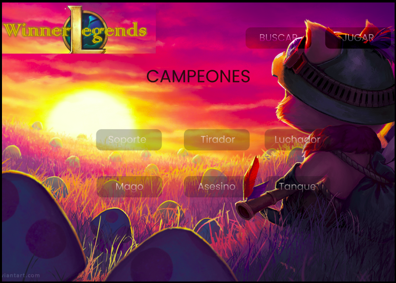
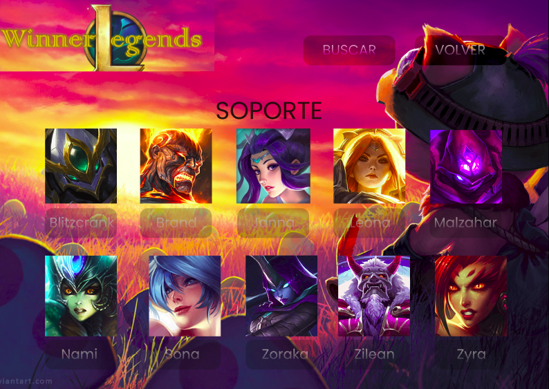
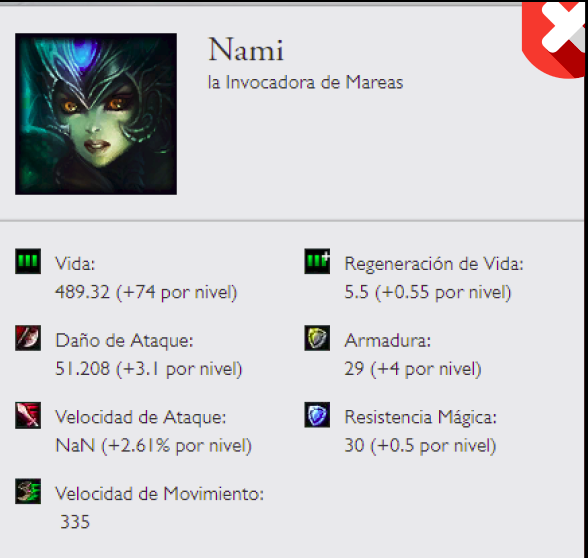

Luego de analizar e intentar satisfacer las necesidades de los usuarios es que modificamos algunas características del prototipo planteado.
Tras esta evaluación se dejó la página con las siguientes propiedades:
1. Botones ubicados en la parte superior para el acceso de cierta información: un botón para el inicio, otro para el acceso de los campeones en donde se despliega todo el contenido de estos.
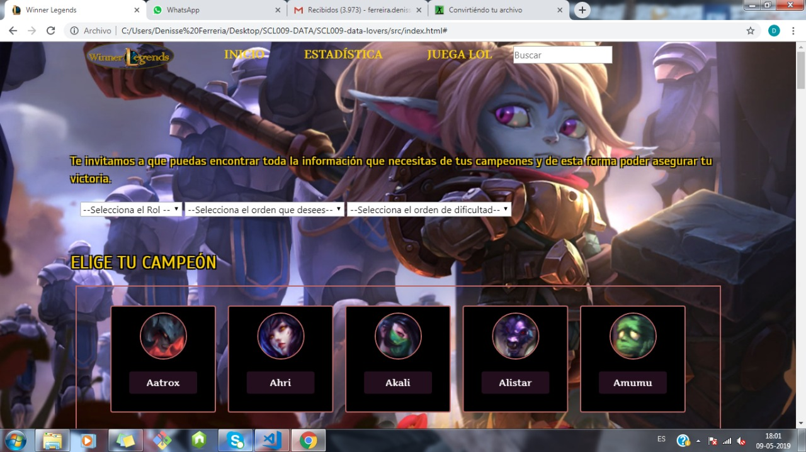

2. Select en la parte media que permiten el filtrado de los campeones de acuerdo a rol, orden alfabético y dificultad. 
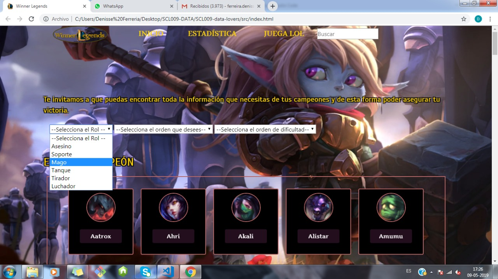
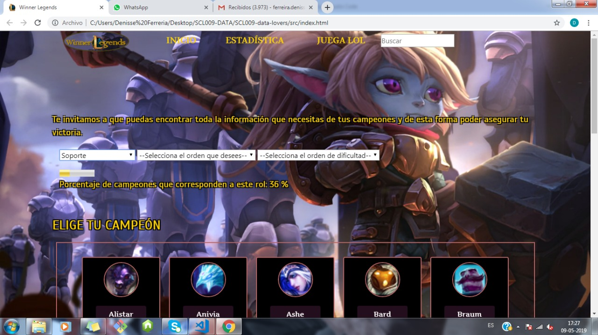
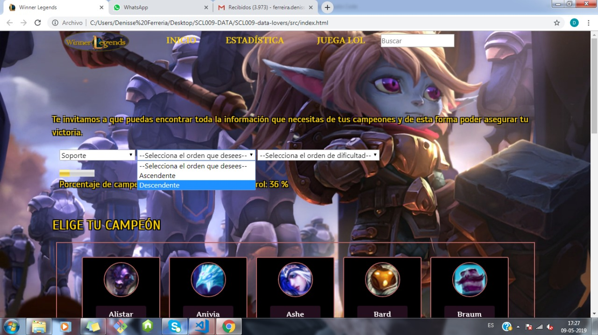
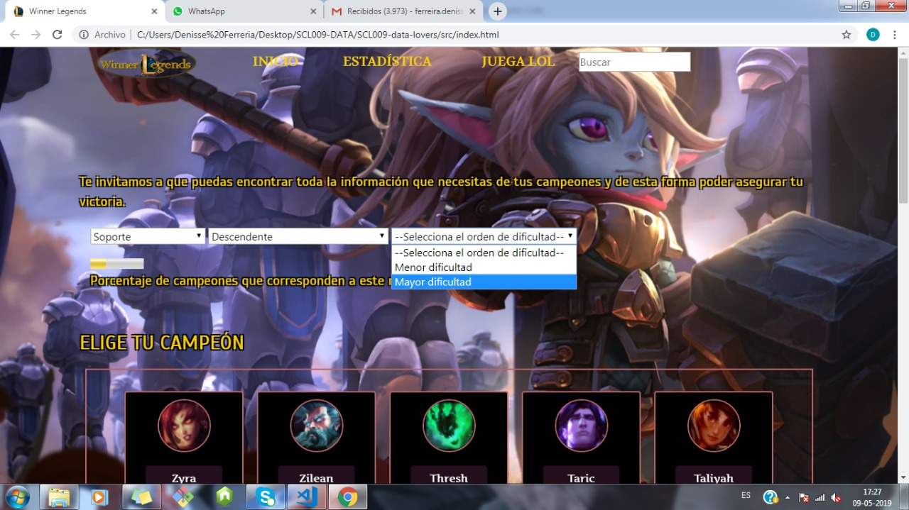

3. Un modal que se despliega posterior al seleccionar un campeón en particular.
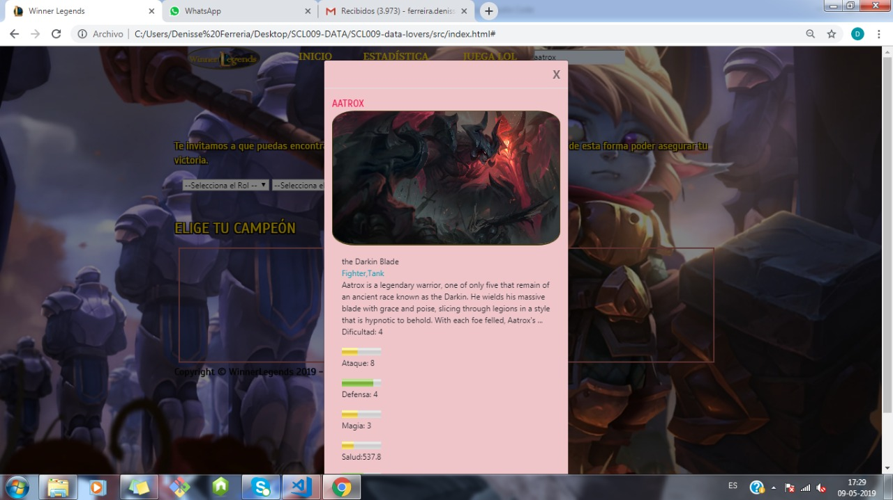

Todo esto se puede observar en la siguiente imagen 

**Caso n°2.**
Yo COMO jugador novato/intermedio de LoL, server LAS, QUIERO comparar la dificultad de los Campeones de un mismo rol, PARA escoger el más adecuado en la partida. 

_Criterios de aceptación._
1. Campeones ordenados por rol.
2. Opción de ordenar los campeones por dificultad.

Se dispuso de un select en el cual los usuarios pueden escoger el orden de dificultad de sus campeones, ya sea de menor a mayor o viceversa. De esta manera se cumplen los criterios de aceptación al estar primero filtrados por rol y luego ordenados de acuerdo a la dificultad.

**Caso n°3.**
Yo COMO jugador novato/intermedio de LoL, server LAS, QUIERO buscar directamente por nombre a un Campeón, PARA conocer sus características y escoger el más adecuado en la partida. 

_Criterios de aceptación._
1.  Campo de búsqueda
2.  Búsqueda con autocompletado
3.  Botón “buscar”
4.  Mostrar campeon

Para cumplir con estos criterios de aceptación se dispuso de un campo de búsqueda que permite encontrar al campeón requerido, y para el hacking edition se espera poder terminar con la busqueda de autocompletado y de esta forma dejar habilitada esa opción, por el momento se cumple con la opción de buscar.
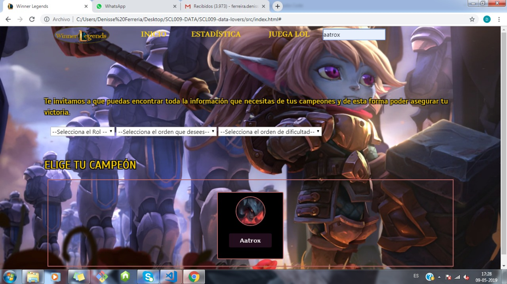

Es así como tras la implementación de este página web logramos resolver los requerimientos básicos expresados por los usuarios.

 

